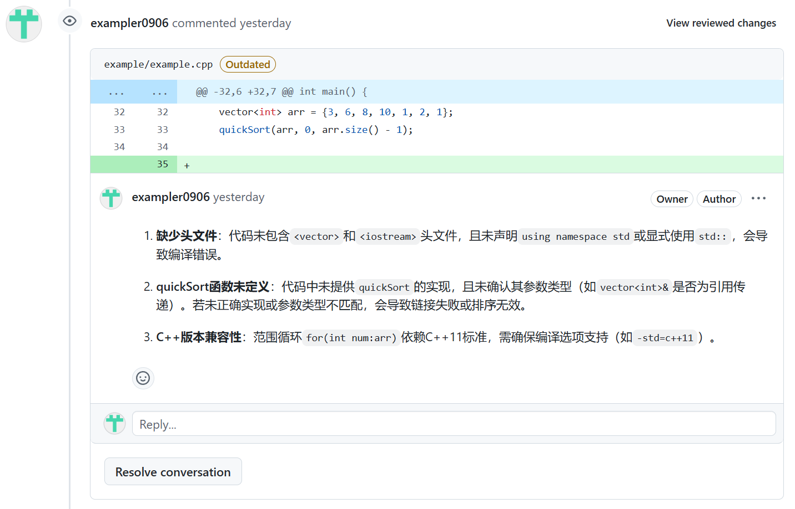
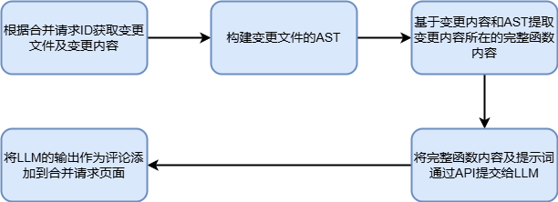

# ai_reviewer

## 🚀 简介

ai_reviewer 是一款基于 **LLM（大语言模型）** 的代码自动化审查工具，它与 **GitHub** 的 **Pull Request** 流程无缝结合，提供了类似人工代码审核的体验。




## 🌟 主要特点

✅ **支持国产大语言模型**：目前兼容 **DeepSeek API**。

✅ **多语言审查能力**：支持 **Python、Java、C++** 代码的自动化审核。

✅ **更精准的审核建议**：代码变更将以 **函数级别** 递交给大语言模型，以获取更准确的审核意见。


## 🏁 快速开始（Quick Start）

### 1️⃣ **基于 GitHub Actions 部署**

**步骤 1** *️⃣将以下内容拷贝到目标仓库的 GitHub Actions 工作流文件中：

```yaml
name: "AI Code Reviewer Example"

# 触发条件（按需修改）
on:
  pull_request:
    types: [opened, synchronize, reopened]

jobs:
  example:
    uses: exampler0906/ai_reviewer/.github/workflows/code_review.yml@main  # 引用复用的工作流
    with:
      PULL_REQUEST_ID: ${{ github.event.pull_request.number }}
      COMMIT_ID: ${{ github.event.pull_request.head.sha }}
      SELF_HOSTED: 'ubuntu-latest'  # 若使用 self-host，请更改为对应的 label
    secrets:
      LLM_API_KEY: ${{ secrets.LLM_API_KEY }}
      LLM_API_URL: ${{ secrets.LLM_API_URL }}
      THIS_GITHUB_TOKEN: ${{ secrets.THIS_GITHUB_TOKEN }}
      REPOSITORY_NAME: ${{ github.event.repository.name }}
      REPOSITORY_OWNER: ${{ github.repository_owner }}
      PROMPT_LEVEL: ${{ secrets.PROMPT_LEVEL }}
```

**步骤 2** *️⃣在目标仓库的 **Actions Secrets** 中配置以下变量：

| 🔑 **变量名**        | 📝 **说明**                                                   |
| ------------------- | ------------------------------------------------------------ |
| `LLM_API_URL`       | 大语言模型 API 地址（目前仅支持 DeepSeek）                   |
| `LLM_API_KEY`       | 大语言模型 API 访问密钥                                      |
| `THIS_GITHUB_TOKEN` | 具有 **仓库读写权限** 和 **public 仓库读权限** 的 GitHub Token |
| `PROMPT_LEVEL`      | 审查提示词等级，范围 `0-3`，数值越高，审查意见越详细         |

**步骤 3** *️⃣运行 GitHub Actions，审查结果将在 **Artifacts** 中生成完整日志。


## 🔄 工作流示意图




## 📌 待优化功能（To Do List）

🔹 **优化 Prompt**

🔹 **基于函数级别的并发审查**（当前是基于文件级别，文件数量少时效率较低）

🔹 **优化变更文件获取逻辑**（目前基于 **PR 全部变更文件**，但未处理 PR 内多个 commit 的情况）

🔹 **改进变更内容提取逻辑**（目前仅支持 **新增代码行**，其他情况暂未处理）

📢 **持续优化中，欢迎贡献！** 🎉